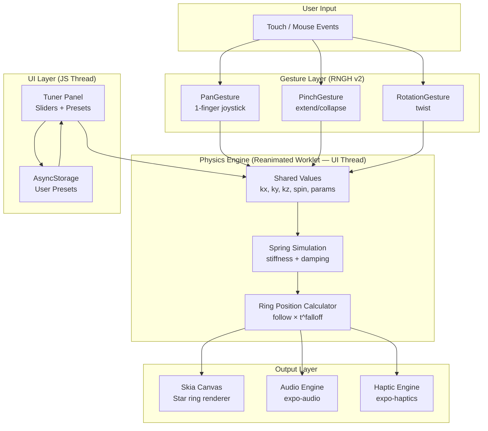
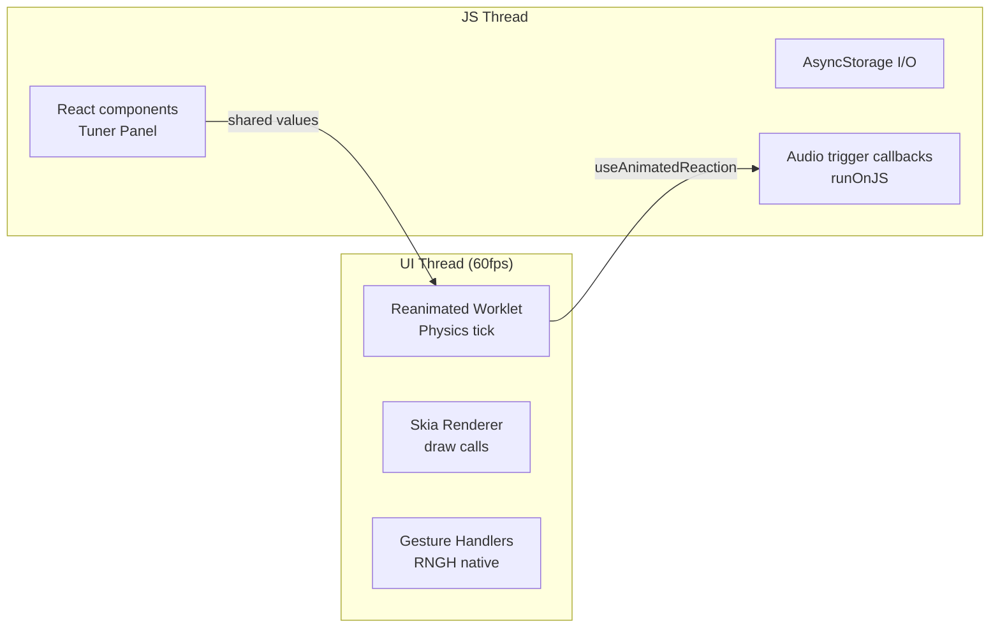
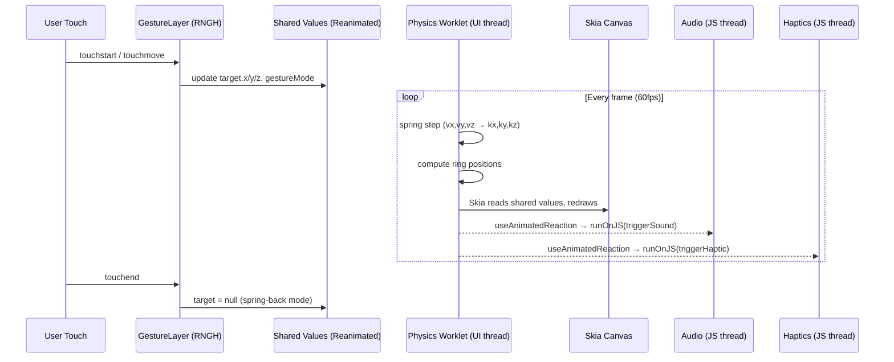

# Software Architecture: Fidget

**Date:** 2026-05-15
**Version:** 1.0 (MVP)

> **Implementation status (Sprint 02, 2026-06-11):** Features 1–7 are implemented in `FidgetApp/`. The shipped stack is Expo SDK 56 / React Native 0.85 / Reanimated 4 / Skia 2.x — newer than the versions named below, which were current when this doc was written. For the version reconciliation table and deliberate divergences (gesture composition, asset pipeline, tuner state readout), see `context/sprint-02-requirements.md`, ADR-006, and ADR-007. Where this doc and the code disagree on API specifics, trust the code; where they disagree on intended behavior, trust `prototype.html`.

---

## Executive Summary

Fidget is a purely client-side tactile toy app — no backend, no auth, no server. The entire experience lives on-device: physics simulation, rendering, sound, and haptics. This radically simplifies the architecture: no API layer, no database hosting, no auth service. The stack is Expo SDK 53 (matching expo-sudoku) targeting iOS, Android, and Web from a single codebase.

The central architectural decision is **React Native Skia + Reanimated worklets** for the render+physics loop. The prototype is a vanilla canvas animation; Skia is the native analog — hardware-accelerated, 60fps capable, and runs physics in a UI thread worklet so JavaScript never blocks the frame. Gesture recognition is `react-native-gesture-handler` (RNGH v2) with simultaneous gesture composition for the 1-finger push, 2-finger twist, and pinch-to-extend interactions.

Sound and haptics are additive layers (expo-audio + expo-haptics) triggered by physics state transitions. Presets persist locally via AsyncStorage. CI/CD runs entirely through Expo Workflows + EAS Build — no custom pipeline needed.

---

## Mindmap: Core Concepts

```
Fidget App
├── Rendering
│   ├── Skia canvas (hardware-accelerated paths)
│   ├── Concentric star rings (N=3–60)
│   ├── Metallic color gradient (outer→inner)
│   └── Contact shadow + lift illusion
│
├── Physics
│   ├── Joystick state (kx, ky, kz)
│   ├── Spring-mass system (stiffness + damping)
│   ├── Ring follow falloff (outer barely moves, inner tracks fully)
│   ├── Twist accumulation + spin momentum
│   └── Extension cone (rings lift in z-axis projection)
│
├── Gestures
│   ├── 1 finger → push (lateral joystick + pull-up)
│   ├── 2 fingers → twist (rotation) + pinch (extend/collapse)
│   └── Release → spring-back (optional)
│
├── Sensory
│   ├── Sound (spring release, ring click, twist whoosh)
│   ├── Haptics (light on contact, medium on snap)
│   └── Visual (shadow depth, color shift on extension)
│
├── Shape Parameters
│   ├── Points (3–20)
│   ├── Inner ratio (star depth)
│   ├── Rings count
│   ├── Outer / min radius
│   └── Spacing play (distribution curve)
│
├── Physics Parameters
│   ├── Float radius (lateral cap)
│   ├── Max pull-up (vertical range)
│   ├── Follow strength + falloff
│   ├── Spring stiffness + damping
│   └── Twist rate
│
└── Presets
    ├── Built-in (Default, Loose, Taut, Floaty)
    └── User-saved (AsyncStorage)
```

---

## Launch Features (MVP)

### Feature 1: Core Fidget Engine
**Description:** The spring-physics simulation that drives all ring positions each frame. This is the heart of the app — everything else is a layer on top. Must run at 60fps without dropping frames.

**Core Requirements:**
* Physics state updated in Reanimated worklet (UI thread, never JS thread)
* Spring model: velocity + position per axis (kx, ky, kz) with stiffness/damping
* Ring follow: `follow * t^falloff` gives inner rings strong tracking, outer rings minimal
* Twist accumulation with momentum decay (coefficient 0.96/frame)
* Configurable spring-back-to-center on pointer release

**Tech Involved:**
* Physics: `react-native-reanimated` shared values + `useAnimatedReaction`
* Geometry: pure TypeScript functions (`starVertices`, `colorAt`) called from worklet
* Parameters: plain JS object passed as worklet context

**Implementation Notes:**
* Port the `tick()` loop from prototype.html verbatim as a Reanimated worklet
* All physics params are shared values so the Tuner panel can hot-update them without JS bridging
* The `useFrameCallback` hook (Reanimated 3) replaces `requestAnimationFrame`

**Estimated Complexity:** Medium
**Priority:** P0 - Blocker

---

### Feature 2: Skia Renderer
**Description:** Draws the concentric star rings each frame using React Native Skia paths. Produces the metallic anodized-look gradient and contact shadow seen in the prototype.

**Core Requirements:**
* Draw N star rings per frame (each a closed path)
* Per-ring fill color from the purple→green metallic gradient
* Optional outline stroke (darkened ring color)
* Contact/lift shadow at bottom of stack
* Float-boundary guide circle (faint dashed) when joystick is active

**Tech Involved:**
* Renderer: `@shopify/react-native-skia` — `<Canvas>`, `<Path>`, `<Paint>`
* Color: interpolated RGB stops matching prototype exactly
* Animation: Skia components accept Reanimated `useSharedValue` values as animated props directly (`useValue` was removed in Skia ^1.0)

**Implementation Notes:**
* Each ring is a `Path` built from `starVertices()` — N×2 points, close path
* Avoid re-allocating `Path` objects every frame; mutate vertices in place
* On Web, Skia uses CanvasKit (WASM) — same API, minor performance difference
* The `drawKnob` function from prototype is unused (innermost ring IS the handle)

**Estimated Complexity:** Medium
**Priority:** P0 - Blocker

---

### Feature 3: Multitouch Gesture Layer
**Description:** Translates raw touch events into joystick commands. Must distinguish 1-finger push from 2-finger twist+pinch, and handle mid-gesture transitions (e.g., 2nd finger lands while dragging).

**Core Requirements:**
* 1 finger: lateral joystick clamped to float radius; vertical pull-up when past float boundary and moving up
* 2 fingers: rotation delta → `userSpin`; spread delta → `kz`
* Mid-gesture transition: 1→2 finger seamlessly switches modes
* Mouse fallback for Web (single-pointer, no twist)

**Tech Involved:**
* Gestures: `react-native-gesture-handler` v2 (`PanGesture`, `PinchGesture`, `RotationGesture`, `Gesture.Simultaneous`)
* State: Reanimated shared values for gesture output
* Platform: `touch-action: none` equivalent via RNGH on Web

**Implementation Notes:**
* Use `Gesture.Simultaneous(pan, pinch, rotation)` — RNGH handles the native touch arbitration
* Store gesture-start snapshot in worklet context (dragStartKx/y/z, gestureStartSpin, gestureStartDist) to compute deltas correctly
* The prototype's mouse handler maps cleanly to a `PanGesture` with `activateAfterLongPress: 0`

**Estimated Complexity:** Medium
**Priority:** P0 - Blocker

---

### Feature 4: Sound Engine
**Description:** Tactile sounds that reinforce the physics — clicks when rings compress, a spring-release tone, whoosh during fast twist. Makes the fidget feel real even without haptic hardware (Web).

**Core Requirements:**
* Ring-click: triggered when extension crosses thresholds (compress/snap)
* Spring-release: tone on pointer-up when kz > threshold
* Twist-whoosh: continuous low sound proportional to `userSpinVel`
* Global mute toggle
* Sounds feel physical, not gamified (subtle, not cartoon)

**Tech Involved:**
* Playback: `expo-audio` (successor to expo-av, SDK 53+)
* Assets: short WAV/MP3 files bundled in `assets/sounds/`
* Triggering: `useAnimatedReaction` watching physics state → `runOnJS` callback

**Implementation Notes:**
* Prepare 3–5 sound variants per event type and pick randomly to avoid repetition fatigue
* Rate-limit click sounds (min 80ms between triggers) to avoid machine-gun effect
* On Web, `expo-audio` falls back to HTML5 Audio — test for autoplay policy (first-touch unlock)
* Avoid `expo-av` — `expo-audio` is the current SDK 53 recommendation

**Estimated Complexity:** Low-Medium
**Priority:** P1 - Critical

---

### Feature 5: Haptic Feedback
**Description:** Device vibration that mirrors the tactile feeling of the physical fidget — light taps on ring compression, a heavier pulse on spring release, subtle rumble during twist.

**Core Requirements:**
* Light impact on ring-click events
* Medium impact on spring-release (snap-back)
* Selection feedback on gesture start
* Toggle: on/off per user preference
* Gracefully absent on Web (no API) and on devices without haptic motors

**Tech Involved:**
* Haptics: `expo-haptics` (`ImpactFeedbackStyle.Light/Medium`, `SelectionAsync`)
* Triggering: same `useAnimatedReaction` → `runOnJS` pipeline as audio
* Storage: user preference in AsyncStorage

**Implementation Notes:**
* Always check `await Haptics.isAvailableAsync()` before calling — don't assume capability
* On Android, haptics quality varies wildly by device; test on physical hardware
* Haptics and audio should fire from the same physics event callback so they're synchronized

**Estimated Complexity:** Low
**Priority:** P1 - Critical

---

### Feature 6: Tuner Panel
**Description:** The floating settings panel from the prototype — lets users adjust every physics and shape parameter in real time. Draggable, collapsible, hideable.

**Core Requirements:**
* Sliders for all parameters (matching prototype ranges/defaults)
* Real-time value display next to each slider
* Preset buttons (Default, Loose float, Taut spring, Floaty)
* Panel is draggable (repositionable on screen)
* Panel can collapse (title bar only) or hide entirely (wrench icon brings it back)
* Toggle switches: spring-back, twist-extended-only, sound, haptics

**Tech Involved:**
* UI: React Native + `react-native-gesture-handler` for drag
* Sliders: custom RN `Slider` component or `@react-native-community/slider`
* State: shared values so slider changes propagate to physics worklet instantly
* Styling: StyleSheet matching the dark purple aesthetic

**Implementation Notes:**
* Use `PanGestureHandler` on the title bar for drag — same pattern as the canvas gesture but targeting panel position
* Clamp panel position to viewport bounds on drag
* All slider `onValueChange` callbacks update Reanimated shared values (not useState) to avoid JS→worklet latency
* Sound and haptics toggles write to AsyncStorage immediately

**Estimated Complexity:** Medium
**Priority:** P1 - Critical

---

### Feature 7: Preset System
**Description:** Save and load fidget configurations. Built-in presets shipped with the app; users can save their own named presets.

**Core Requirements:**
* 4 built-in presets (Default, Loose float, Taut spring, Floaty) — hardcoded
* User can save current params as a named preset
* User presets persist across app restarts (AsyncStorage)
* Load preset: smooth animated transition of all params (not a snap)

**Tech Involved:**
* Storage: `@react-native-async-storage/async-storage`
* Animation: Reanimated `withSpring` / `withTiming` for param transitions
* Serialization: JSON — the `params` object is already plain numbers/booleans

**Implementation Notes:**
* Store user presets as `fidget_presets` key → JSON array of `{name, params}` objects
* Limit to 20 user presets (show delete UI when at limit)
* Built-in presets are constants, never written to AsyncStorage

**Estimated Complexity:** Low
**Priority:** P2 - Important

---

## Future Features (Post-MVP)

### Feature 8: Sound Design Mode
**Description:** Let users tune the audio character of their fidget — pitch, reverb, click type (metallic, wooden, soft). Sound presets that pair with physics presets.

**Tech Involved:** Web Audio API via Expo's web support, react-native-audio-pro for native

---

### Feature 9: Color Themes
**Description:** Swap the metallic color gradient (e.g., gold anodized, copper, neon, dark carbon). Theme picker in the Tuner panel.

**Tech Involved:** Parameterized `colorAt()` function with swappable stop arrays

---

### Feature 10: Share / Screenshot
**Description:** Export a static image of the current fidget state to share on social media.

**Tech Involved:** `expo-view-shot` or Skia's `makeImageSnapshot()`

---

### Feature 11: Physics Toys Mode
**Description:** Secondary interaction modes — gravity-responsive (device tilt via accelerometer), auto-animate (fidget moves itself to a rhythm), loop recording (record and replay a gesture).

**Tech Involved:** `expo-sensors` (Accelerometer), `expo-av` for recording gestures

---

### Feature 12: App Store Submission
**Description:** Production build, privacy manifest, App Store/Play Store assets, review submission.

**Tech Involved:** EAS Submit, App Store Connect, Google Play Console

---

## System Architecture

### High-Level Architecture



### Thread Model



The render loop **never crosses the JS bridge** — physics and drawing stay on the UI thread. Only the Tuner panel sliders and audio triggers touch JS.

---

## Technology Stack

### Core Framework
- **Framework:** Expo SDK 53 (matching expo-sudoku reference)
- **React:** 19.0.0
- **React Native:** 0.79.2
- **Language:** TypeScript (strict mode)
- **Routing:** None needed (single-screen app) — `index.tsx` is the whole app

### Rendering
- **Library:** `@shopify/react-native-skia` ^1.x
- **Why:** Hardware-accelerated canvas on iOS/Android/Web; same path API as the prototype's canvas 2D; integrates natively with Reanimated worklets; no JS bridge for draw calls
- **Alternative considered:** `react-native-canvas` (abandoned), `expo-gl` (too low-level), plain `Animated` (no path drawing)

### Physics / Animation
- **Library:** `react-native-reanimated` ~3.x
- **Why:** Worklets run on UI thread at 60fps, shared values eliminate JS bridge for parameter changes, `useFrameCallback` is a perfect `requestAnimationFrame` replacement
- **Alternative considered:** `react-native-game-engine` (overhead, not needed for single-object sim)

### Gestures
- **Library:** `react-native-gesture-handler` ~2.24.0 (matching expo-sudoku)
- **Why:** Native gesture recognizers, `Gesture.Simultaneous` handles 1→2 finger transitions correctly, Web support via pointer events
- **Patterns:** `PanGesture` + `PinchGesture` + `RotationGesture` composed with `Gesture.Simultaneous`

### Audio
- **Library:** `expo-audio` (SDK 53 — successor to expo-av)
- **Assets:** Bundled WAV files in `assets/sounds/` (< 50KB total)
- **Pattern:** Preload all sounds on mount; trigger via `runOnJS` from physics worklet reaction

### Haptics
- **Library:** `expo-haptics`
- **Pattern:** Fire `ImpactFeedbackStyle.Light` on ring-click events, `.Medium` on spring-release

### Persistence
- **Library:** `@react-native-async-storage/async-storage` 2.1.2
- **Use:** User-saved presets only; params object JSON-serialized

### CI/CD
- **Platform:** Expo Workflows (https://expo.dev/services/workflows)
- **Builds:** EAS Build (managed workflow)
- **Delivery:** Expo Go for development; EAS Update for OTA; App Store/Play Store later
- **Branching:** main → production preview; feature branches → development builds

---

## Repository Structure

The repo is documentation-first — agents read `context/` before touching code. All Expo app code lives in `FidgetApp/`.

```
fidget/                              # Repo root — docs are the primary layer
├── context/                         # Agent context: architecture, specs, decisions
│   ├── 01_architecture.md           # This file
│   ├── sprint-NN-requirements.md    # Active sprint spec
│   └── decisions/                   # ADRs — one file per significant decision
├── prototype.html                   # Reference implementation
├── README.md                        # Human overview
├── CLAUDE.md                        # Agent orientation (paths, workflow, conventions)
└── FidgetApp/                       # All Expo app code
    ├── app/
    │   ├── _layout.tsx              # Root layout (StatusBar, SafeArea)
    │   └── index.tsx                # Single screen — mounts FidgetCanvas + TunerPanel
    ├── src/
    │   ├── engine/
    │   │   ├── types.ts             # FidgetParams, FidgetState interfaces
    │   │   ├── geometry.ts          # starVertices(), colorAt() — worklet-safe pure fns
    │   │   └── physics.ts           # usePhysicsEngine() hook — Reanimated worklet + shared values
    │   ├── components/
    │   │   ├── FidgetCanvas.tsx     # Skia <Canvas> — reads shared values, draws rings
    │   │   ├── GestureLayer.tsx     # RNGH gesture composition → writes shared values
    │   │   └── TunerPanel.tsx       # Floating settings panel (sliders, presets, toggles)
    │   ├── audio/
    │   │   └── useAudioEngine.ts    # Preload sounds; expose trigger functions
    │   ├── haptics/
    │   │   └── useHapticEngine.ts   # Wrap expo-haptics; check availability
    │   └── store/
    │       └── presets.ts           # AsyncStorage read/write for user presets
    └── assets/
        └── sounds/
            ├── click-01.wav
            ├── click-02.wav
            ├── click-03.wav
            ├── spring-release.wav
            └── twist-whoosh.wav
```

---

## Physics Parameter Reference

These are the exact parameters from the prototype, mapped to TypeScript:

```typescript
interface FidgetParams {
  // Joystick
  float: number;        // 0–160,  default 60   — lateral float radius (px)
  pull: number;         // 20–220, default 110  — max vertical extension (px)
  follow: number;       // 0–1.2,  default 0.55 — ring follow strength
  falloff: number;      // 0.2–3,  default 1.40 — follow falloff exponent
  spring: number;       // 0.02–0.5, default 0.18 — spring stiffness
  damp: number;         // 0.5–0.98, default 0.78 — velocity damping
  springBack: boolean;  // default true

  // Shape
  points: number;       // 3–20,  default 10   — star points
  ratio: number;        // 0.4–1, default 0.78 — inner/outer radius ratio
  rings: number;        // 6–60,  default 28   — concentric ring count
  outer: number;        // 80–260, default 170 — outermost ring radius (px)
  min: number;          // 4–80,  default 22   — innermost ring radius (px)
  play: number;         // 0.4–2, default 1.10 — ring spacing curve exponent

  // Motion
  twist: number;        // 0–3,   default 0.8  — degrees twist per ring
  twistExtendedOnly: boolean; // default true

  // Render
  outline: number;      // 0–120, default 60   — outline darkness offset

  // Sensory
  soundEnabled: boolean;
  hapticsEnabled: boolean;
}
```

---

## Data Flow



---

## Key Architectural Decisions

### ADR-001: React Native Skia over Expo GL / Animated
**Context:** Need per-frame custom path drawing of N star rings (up to 60), hardware-accelerated, on iOS/Android/Web.
**Decision:** `@shopify/react-native-skia`
**Consequences:** Best-in-class 2D canvas for React Native; native Skia engine; integrates with Reanimated worklets; same concept as prototype's canvas 2D. CanvasKit on Web adds ~2MB WASM but is acceptable.

### ADR-002: Reanimated Worklets over JS-thread physics
**Context:** 60fps physics simulation; any JS bridge crossing risks frame drops.
**Decision:** `react-native-reanimated` v3 worklets via `useFrameCallback`
**Consequences:** Physics runs on UI thread, zero bridge crossings per frame. Shared values propagate slider changes instantly. `runOnJS` only for audio/haptic side effects.

### ADR-003: No Backend
**Context:** Fidget is a self-contained toy. No user accounts, no cloud sync, no leaderboard.
**Decision:** 100% client-side. AsyncStorage for presets only.
**Consequences:** Zero infrastructure cost; works fully offline; instant load. Future multiplayer or cloud sync would require adding a backend later.

### ADR-004: Documentation-First Repository Structure
**Context:** Development is agent-driven; agents start each session cold with no memory.
**Decision:** `context/` and `CLAUDE.md` are the primary repo layer. App code lives in `FidgetApp/`. Every sprint produces a requirements doc before code.
**Consequences:** Agents orient in a few file reads. ADRs prevent decision churn. See `context/decisions/004-documentation-first-repo-structure.md`.

### ADR-005: expo-audio over expo-av
**Context:** SDK 53 deprecates expo-av Audio in favor of expo-audio.
**Decision:** `expo-audio`
**Consequences:** Forward-compatible with SDK 53+. expo-av Video API still available if needed for other features.

### ADR-006: Simultaneous gesture composition
**Context:** 1→2 finger transition mid-drag needs seamless mode switch.
**Decision:** `Gesture.Simultaneous(pan, pinch, rotation)` with mode tracking in shared value
**Consequences:** RNGH handles native touch arbitration; no custom touch responder needed. Mode switching (one/two/idle) happens in worklet context.

---

## Sound Design Notes

Sound files should be short (< 200ms), normalized to -6dBFS, with natural decay (no hard clip at end). Target feel: anodized metal fidget toy, not a game.

| Event | Sound character | Trigger condition |
|-------|----------------|-------------------|
| Ring click | Metallic tap, ~80ms | `extension` crosses 0.2, 0.5, 0.8 thresholds |
| Spring release | Soft tone, 150ms decay | pointer-up with `kz > 20px` |
| Twist whoosh | Wind swish, looped | `abs(userSpinVel) > 5°/frame` |
| Max extension | Subtle resonant ping | `kz ≥ params.pull * 0.95` |

---

## Scalability Strategy

This app has no server to scale. "Scale" means:

**Phase 1 (MVP — Expo Go):** Single screen, basic presets, sound, haptics.

**Phase 2 (App Stores):** EAS Submit, privacy manifest, App Store assets, 60fps benchmark on oldest supported device (iPhone 12, Pixel 5).

**Phase 3 (Expansion):** Additional shapes (hexagon, custom polygon), sound design mode, color themes, share/screenshot.

**Performance floor:** The prototype runs 28 rings × 60fps comfortably in a browser canvas. Skia on native is faster. Target devices: iPhone 12+ (iOS), Pixel 5+ (Android). The innermost loop (starVertices × N rings) is pure math — profile if rings > 50 causes frame drops.

---

## Development Phases

### Phase 1: Core Loop (Days 1–3)
- Expo project setup (matching expo-sudoku config)
- Install Skia + Reanimated + RNGH
- Port `starVertices()` and `colorAt()` to TypeScript
- Physics worklet running in `useFrameCallback`
- Skia canvas rendering rings

### Phase 2: Gestures (Days 4–5)
- `GestureLayer` with Simultaneous gesture composition
- 1-finger joystick: lateral + pull-up
- 2-finger: twist + pinch-to-extend
- Mouse fallback for Web

### Phase 3: Tuner Panel (Days 6–7)
- Draggable floating panel
- All sliders connected to Reanimated shared values
- Presets: built-in + AsyncStorage save/load

### Phase 4: Sensory (Days 8–9)
- Sound assets (record or source)
- Audio engine + trigger reactions
- Haptic engine + trigger reactions
- Sound/haptic toggles

### Phase 5: Polish (Days 10–11)
- Contact shadow depth
- Float-boundary guide circle
- Smooth preset transitions
- Web testing (Expo web, CanvasKit)
- Expo Workflows CI pipeline

---

## Questions Before Feature Spec

1. **Shape vocabulary:** Is the star (10 points) the hero shape, or do users start by picking a shape? Should the shape selector be in the Tuner or on the main screen?
2. **Sound assets:** Record custom sounds (physical fidget toy) or synthesize procedurally using Web Audio? Procedural is more flexible; recorded is more authentic.
3. **Haptic intensity curve:** Should haptic strength scale with velocity (e.g., faster twist = stronger rumble) or always be a single intensity level?
4. **Web priority:** Is Web a first-class target (Expo web build) or just a nice-to-have? CanvasKit WASM loads slowly on first visit.
5. **Sharing / social:** Any need to export or share a fidget state (as a link or image) at MVP?
6. **Multiple fidgets:** MVP is single fidget on screen, right? (No multi-fidget or collection browser needed yet?)

---

## Appendix: Key Package Versions (matching expo-sudoku baseline)

| Package | Version |
|---------|---------|
| expo | 53.0.9 |
| react | 19.0.0 |
| react-native | 0.79.2 |
| react-native-gesture-handler | ~2.24.0 |
| react-native-reanimated | ~3.x |
| @shopify/react-native-skia | ^1.x |
| expo-audio | ~0.4.x |
| expo-haptics | ~14.x |
| @react-native-async-storage/async-storage | 2.1.2 |
| react-native-safe-area-context | ^5.4.0 |

---

*No backend. No auth. Just physics.*
*Architecture designed for single-screen MVP with clear path to App Store.*
